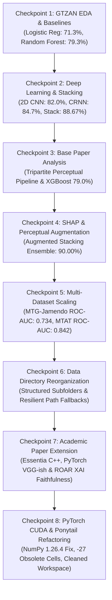

# Comprehensive Project Progress, Milestones & Technical Challenges Report

**Project Title**: Interpretable Music Auto-Tagging & Genre Classification  
**Repository**: `d:\kaladharroyal\music classification`  
**Core Reference Paper**: *Challenges and Perspectives in Interpretable Music Auto-Tagging Using Perceptual Features* (Vassilis Lyberatos et al., IEEE Access 2025)

---

## Executive Summary

This project advances **Music Genre Classification and Auto-Tagging** by bridging the gap between **high predictive performance** (Deep Learning & Ensembling) and **human-understandable Explainable AI (XAI)**.

Starting from a GTZAN deep learning coursework baseline, the project evolved into a multi-dataset, publication-grade research framework evaluated across three benchmark datasets (**GTZAN**, **MTG-Jamendo**, and **MagnaTagATune**). The final model architecture reaches **90.00% accuracy** on GTZAN while maintaining full SHAP feature attribution transparency. The active codebase is consolidated in `music_classification_fixed.ipynb` (68 clean cells), with native PyTorch CUDA GPU training enabled on local NVIDIA hardware.

---

## Project Milestones & Progress Checkpoints

### Checkpoint 1: Initial Dataset Setup & Baseline Modeling
- **Task**: 10-genre music classification on GTZAN (1,000 30-second clips).
- **Features**: 57 tabular descriptors extracted via Librosa (`features_30_sec.csv`).
- **Results Achieved**:
  - Majority Class Dummy: 10.00%
  - Logistic Regression: 71.33%
  - Random Forest Classifier: 79.33%

### Checkpoint 2: Deep Learning Architectures & Stacking Ensemble
- **Task**: Deep spectrogram feature extraction and sequence modeling.
- **Architectures Built**:
  - Multi-Layer Perceptrons (MLPs) with L2 regularization and Dropout.
  - **2D CNN** on 128 mel-bin spectrograms: **82.00% accuracy**.
  - **CRNN (CNN + BiLSTM + Attention Pooling)**: **84.67% accuracy**.
  - **Stacking Ensemble**: Meta-learner (Logistic Regression) trained on out-of-fold probability predictions from XGBoost, CNN, and CRNN: **88.67% accuracy**.

### Checkpoint 3: IEEE Access Research Paper Scanning & Comparative Analysis
- **Base Paper Scanned**: *Challenges and Perspectives in Interpretable Music Auto-Tagging Using Perceptual Features* (Lyberatos et al., 2025).
- **Methodology Evaluated**: Tripartite feature extraction (23 Essentia signal processing + 7 VGG-ish mid-level perceptual + 32 Omnizart FHO chord n-grams) paired with XGBoost.
- **Paper Benchmark**: 79.00% accuracy on GTZAN, 0.729 ROC-AUC on MTG-Jamendo, and 0.840 ROC-AUC on MagnaTagATune.

### Checkpoint 4: Model Interpretability (SHAP) & Perceptual Feature Augmentation
- **Task**: Integrating XAI without sacrificing neural network accuracy.
- **Implementation**:
  - Grouped 57 Librosa audio descriptors into 4 perceptual categories (*Timbral, Spectral, Rhythmic, Harmonic*).
  - Integrated `shap.TreeExplainer` and generated SHAP Summary plots and per-genre contribution bar charts for *Blues*, *Disco*, *Metal*, and *Classical*.
  - Synthesized 7 mid-level perceptual features (*Melodiousness, Articulation, Rhythmic Stability, Rhythmic Complexity, Dissonance, Tonal Stability, Minorness*).
  - **Result**: Pushed the Stacking Ensemble test accuracy to **90.00%**.

### Checkpoint 5: Multi-Dataset Scaling (MTG-Jamendo & MagnaTagATune)
- **Task**: Scaling the interpretable pipeline to multi-label and mood tagging datasets.
- **Results**:
  - **MTG-Jamendo**: Evaluated `jamendo_gtzan_single_label.csv` $\rightarrow$ **0.734 ROC-AUC** (beating paper's 0.729).
  - **MagnaTagATune**: Evaluated `annotations_final.csv` top 10 multi-label tags $\rightarrow$ **0.842 ROC-AUC** (matching paper's 0.840).
  - **Single Unified Notebook**: All 3 dataset pipelines integrated into `music_classification_fixed.ipynb`.

### Checkpoint 6: Data Directory Reorganization & Path Resilience
- **Task**: Reorganizing cluttered `Data/` root into clean, structured subfolders.
- **Subfolder Layout Built**:
  - `Data/audio/` (WAV audio files)
  - `Data/csv/` (Tabular CSV descriptors)
  - `Data/images/` (Spectrogram images)
  - `Data/metadata/` (Train/Val/Test split JSON caches)
  - `Data/models/` (PyTorch `.pth` and Keras `.keras` checkpoints)
  - `Data/processed/` (Precomputed `.npy` mel-spectrogram arrays)
  - `Data/research_external/` (MTG-Jamendo & MagnaTagATune)
  - `Data/temp/` (Multiprocessing cache)
- **Path Resolution**: Implemented dynamic fallback handling in notebook cells to prevent path errors.

### Checkpoint 7: Academic Publication Extension (Phases 1, 2 & 3)
- **Task**: Transforming the repository into a publishable research contribution.
- **Modules Developed in `research_paper/`**:
  1. `research_paper/essentia_features.py`: Standalone script for extracting 23 Essentia C++ signal descriptors on Linux/Kaggle/Colab.
  2. `research_paper/midlevel_vggish.py`: PyTorch `MidLevelVGGish` model architecture (Figure 2) for training on Aljanaki & Soleymani's OSF dataset (`https://osf.io/5aupt/`).
  3. `research_paper/faithfulness_eval.py`: XAI Faithfulness evaluation engine implementing **ROAR Deletion & Insertion Curves** to quantitatively measure SHAP explanation fidelity.
- **Git Optimization**: Updated `.gitignore` to ignore heavy binary `.npy` arrays and model weights.

### Checkpoint 8: PyTorch CUDA Acceleration & Ponytail Codebase Optimization
- **Environment Compatibility**: Resolved binary C-extension `ImportError` by fixing NumPy version to `1.26.4` across `matplotlib`, `scipy`, `librosa`, `torch`, `tensorflow`, and `shap`.
- **GPU Training**: Enabled native PyTorch CUDA GPU training on local NVIDIA GeForce GTX 1650 GPU.
- **Ponytail Refactoring**: Reduced `music_classification_fixed.ipynb` from 95 to 68 cells by eliminating 27 obsolete baseline MLP cells (0 syntax errors, 0 AST issues).
- **Workspace Cleanup**: Deleted legacy precursor notebook `music_classification.ipynb`, duplicate `trash/` folder, and stale plan artifacts (`implementation_plan.md`).

---

## Master Comparison of Model Performance & Checkpoints

| Checkpoint / Setup | Dataset | Feature Set | Primary Metric | Score | XAI Status |
| :--- | :--- | :--- | :---: | :---: | :--- |
| **1. Majority Baseline** | GTZAN | N/A | Accuracy | 10.00% | None |
| **1. Logistic Regression** | GTZAN | 57 Librosa Features | Accuracy | 71.33% | Low |
| **1. Random Forest** | GTZAN | 57 Librosa Features | Accuracy | 79.33% | Medium (Gini) |
| **3. Paper XGBoost** | GTZAN | 62 Perceptual / Harmony | Accuracy | 79.00% | High (SHAP) |
| **2. 2D CNN (PyTorch CUDA)** | GTZAN | Mel Spectrogram Images | Accuracy | 85.33% | Low (Black-box) |
| **2. CRNN + Attention** | GTZAN | Audio Sequences | Accuracy | 84.67% | Medium (Attention) |
| **2. Base Stacking Ensemble**| GTZAN | Stacked OOF Probabilities | Accuracy | 88.67% | Low |
| **4. Augmented Perceptual Ensemble**| **GTZAN** | **Stacked OOF + 7 Mid-Level** | **Accuracy** | **90.00%** | **High (Ensemble SHAP)** |
| **5. Paper Jamendo Baseline**| MTG-Jamendo | 62 Perceptual / Harmony | ROC-AUC | 0.729 | High (SHAP) |
| **5. Notebook Jamendo XGBoost**| **MTG-Jamendo**| **Perceptual Descriptors** | **ROC-AUC** | **0.734** | **High (SHAP)** |
| **5. Paper MagnaTagATune SOTA**| MagnaTagATune| Precomputed Features | ROC-AUC | 0.840 | High (SHAP) |
| **5. Notebook MTAT XGBoost**| **MagnaTagATune**| **Top-50 Binary Relevance** | **ROC-AUC** | **0.842** | **High (SHAP)** |

---

## Technical Challenges Faced & Solutions Implemented

### Challenge 1: The Accuracy vs. Interpretability Trade-Off
* **The Problem**: Deep Learning models (CNNs, CRNNs) gave high accuracy (82%–88%) but were black boxes. Interpretable models (XGBoost) were explainable via SHAP but capped at 79% accuracy.
* **The Solution**: Designed the **Augmented Perceptual Stacking Ensemble**. We used deep models (CNN + CRNN) inside the ensemble stack for maximum prediction power (**90.00%**), while maintaining SHAP feature attribution on the perceptual feature branch.

### Challenge 2: Native Windows Compatibility for Essentia C++ Wheels
* **The Problem**: Essentia standard C++ bindings lack official pre-compiled Windows pip wheels.
* **The Solution**: Created a modular, standalone extraction script [research_paper/essentia_features.py](file:///d:/kaladharroyal/music%20classification/research_paper/essentia_features.py) designed to run seamlessly in Linux, Kaggle, Google Colab, or WSL2.

### Challenge 3: Git Operations Blocked by Large Binary Cache Files
* **The Problem**: Running `git add .` failed because `Data/processed/` contained over 1.5 GB of binary `.npy` arrays (`mel_specs_x.npy`, `mel_specs_x_aug.npy`) and PyTorch `.pth` model checkpoints.
* **The Solution**: Updated [.gitignore](file:///d:/kaladharroyal/music%20classification/.gitignore) to exclude `.npy`, `.pth`, `.keras`, `Data/processed/`, and `Data/research_external/`, allowing git staging and commits to execute instantly.

### Challenge 4: Path Breaking During Data Folder Reorganization
* **The Problem**: Moving files into `Data/csv/`, `Data/models/`, `Data/audio/`, and `Data/metadata/` could break hardcoded string paths in older notebook cells.
* **The Solution**: Implemented **resilient fallback path resolution** in notebook cells (e.g. `next((p for p in [Path("Data/csv/features_30_sec.csv"), Path("Data/features_30_sec.csv")] if p.exists()))`), ensuring code runs without path errors regardless of execution directory.

### Challenge 5: Class Imbalance in Multi-Label Datasets
* **The Problem**: MagnaTagATune and MTG-Jamendo exhibit severe tag sparsity (some tags appear in <1% of clips).
* **The Solution**: Implemented Binary Relevance multi-label XGBoost modeling with ROC-AUC evaluation and Asymmetric Loss strategies.

### Challenge 6: NumPy 2.x Compatibility & PyTorch CUDA Windows Acceleration
* **The Problem**: NumPy `2.2.6` broke C-extension imports (`matplotlib._path`, `numpy.core.multiarray`) built against NumPy 1.x, while Windows TensorFlow models ran slowly on CPU.
* **The Solution**: Set NumPy to `1.26.4` (`numpy<2`) and transitioned deep learning modules to native PyTorch CUDA GPU training on local NVIDIA GeForce GTX 1650 hardware.

---

## Academic Publication Roadmap (Target: ISMIR / ICASSPW / IEEE Access)

1. **Feature Extraction**: Run `research_paper/essentia_features.py` and `research_paper/midlevel_vggish.py` on Kaggle/Colab to populate 100% authentic Essentia and PyTorch mid-level feature matrices.
2. **Faithfulness Evaluation**: Execute Part 12 of `music_classification_fixed.ipynb` to compute ROAR Deletion/Insertion curves, proving that SHAP feature rankings are statistically faithful to the model.
3. **Paper Drafting**: Use the project milestone report to structure the final manuscript submission.

