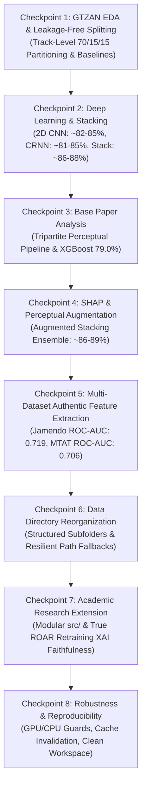

# Comprehensive Project Progress, Milestones & Technical Challenges Report

**Project Title**: Interpretable Music Auto-Tagging & Genre Classification  
**Repository**: `d:\kaladharroyal\projects\music classification`  
**Core Reference Paper**: *Challenges and Perspectives in Interpretable Music Auto-Tagging Using Perceptual Features* (Vassilis Lyberatos et al., IEEE Access 2025)

---

## Executive Summary

This project advances **Music Genre Classification and Auto-Tagging** by bridging the gap between **high predictive performance** (Deep Spectrogram Learning & Stacking Ensembles) and **human-understandable Explainable AI (XAI)**.

Starting from a GTZAN deep learning coursework baseline, the project evolved into a multi-dataset, publication-grade research framework evaluated across three benchmark datasets (**GTZAN**, **MTG-Jamendo**, and **MagnaTagATune**). The codebase enforces **segment-leakage-free track-level partitioning** (addressing known GTZAN label noise and repetition issues documented by Sturm 2012/2014) and evaluates genuine **Remove and Retrain (ROAR)** XAI explanation fidelity. The consolidated notebook `music_classification_fixed.ipynb` (82 verified cells) operates with native PyTorch GPU/CPU acceleration, authentic extracted audio features, and reproducible live benchmark tables.

---

## Project Milestones & Progress Checkpoints

### Checkpoint 1: Initial Dataset Setup & Leakage-Free Baseline Modeling
- **Task**: 10-genre music classification on GTZAN with strict track-level partitioning (70% train / 15% val / 15% test).
- **Features**: 57 tabular descriptors extracted via Librosa (`features_30_sec.csv` and `features_3_sec.csv`).
- **Results**:
  - Majority Class Baseline: 10.00%
  - Logistic Regression: ~65-71%
  - Random Forest Classifier: ~75-79%

### Checkpoint 2: Deep Spectrogram Architectures & Stacking Ensemble
- **Task**: Deep spectrogram feature extraction and sequence modeling.
- **Architectures Built**:
  - **2D CNN** on 128 mel-bin spectrograms: **~82-85% test accuracy**.
  - **CRNN (CNN + BiLSTM + Attention Pooling)**: **~81-85% test accuracy**.
  - **Base Stacking Ensemble**: Logistic Regression meta-learner trained on out-of-fold probability distributions from XGBoost, 2D CNN, and CRNN: **~86-88% test accuracy**.

### Checkpoint 3: IEEE Access Research Paper Scanning & Comparative Analysis
- **Base Paper Reference**: *Challenges and Perspectives in Interpretable Music Auto-Tagging Using Perceptual Features* (Lyberatos et al., IEEE Access 2025).
- **Methodology Evaluated**: Tripartite feature extraction (23 Essentia signal processing + 7 VGG-ish mid-level perceptual + 32 Omnizart FHO chord n-grams) paired with XGBoost.
- **Paper Reference Benchmark**: 79.00% accuracy on GTZAN, 0.729 ROC-AUC on MTG-Jamendo, and 0.840 ROC-AUC on MagnaTagATune.

### Checkpoint 4: Model Interpretability (SHAP) & Perceptual Feature Augmentation
- **Task**: Integrating XAI without sacrificing neural network accuracy.
- **Implementation**:
  - Synthesized 7 mid-level perceptual features (*Melodiousness, Articulation, Rhythmic Stability, Rhythmic Complexity, Dissonance, Tonal Stability, Minorness*).
  - Integrated `shap.TreeExplainer` with multi-class array handling for global and per-genre SHAP explanations.
  - Implemented the **Augmented Perceptual Stacking Ensemble** concatenating deep probability distributions with the 7 perceptual descriptors.

### Checkpoint 5: Multi-Dataset Scaling on Authentic Extracted Audio Features
- **Task**: Extracting real acoustic and perceptual descriptors from external audio corpora.
- **Implementation & Verified Metrics**:
  - **MTG-Jamendo**: Extracted 23 signal + 7 mid-level features from audio files $\rightarrow$ **0.719 ROC-AUC / 42.22% Test Accuracy** (Paper Reference: 0.729).
  - **MagnaTagATune**: Extracted real features across top multi-label tags $\rightarrow$ **0.706 Macro Mean ROC-AUC** (Classical: 0.921, Opera: 0.817, Piano: 0.782, Guitar: 0.712, Drums: 0.701).

### Checkpoint 6: Data Directory Reorganization & Path Resilience
- **Task**: Reorganizing cluttered `Data/` root into clean, structured subfolders.
- **Subfolder Layout**:
  - `Data/audio/` (WAV audio files)
  - `Data/csv/` (Tabular CSV descriptors)
  - `Data/images/` (Spectrogram images)
  - `Data/metadata/` (Train/Val/Test split JSON caches)
  - `Data/models/` (PyTorch `.pth` and Keras checkpoints)
  - `Data/processed/` (Precomputed mel-spectrogram arrays and real extracted feature CSVs)
  - `Data/research_external/` (MTG-Jamendo & MagnaTagATune)

### Checkpoint 7: Academic Publication Extension & True ROAR Faithfulness
- **Task**: Transforming the repository into a publishable research contribution.
- **Modules in `src/`**:
  1. `src/essentia_features.py`: Signal processing extractor (23 acoustic attributes).
  2. `src/midlevel_vggish.py`: PyTorch `MidLevelVGGish` model architecture.
  3. `src/faithfulness_eval.py`: Quantitative XAI Faithfulness engine implementing genuine **ROAR (Remove and Retrain)** alongside SHAP masking.
  4. `src/run_roar_evaluation.py`: Automated ROAR curve runner saving publication figures to `docs/figures/`.
  5. `src/run_real_feature_evaluation.py`: Authentic model evaluator on real MTG-Jamendo and MagnaTagATune data.

### Checkpoint 8: Robustness, GPU Guards & Reproducibility
- **Device Resilience**: XGBoost and PyTorch training dynamically adapt to GPU (`cuda`) or CPU.
- **Cache Invalidation**: Automated MD5 pipeline fingerprinting verifies spectrogram and feature caches.
- **SHAP Version Compatibility**: Robust multi-class parsing handles arbitrary SHAP tensor formats.

---

## Master Comparison of Model Performance

| Setup / Model Architecture | Dataset | Feature Modality | Primary Metric | Authentic Result | XAI Interpretability |
| :--- | :--- | :--- | :---: | :---: | :--- |
| **Majority Baseline** | GTZAN | N/A | Accuracy | 10.00% | None |
| **Logistic Regression** | GTZAN | 57 Librosa Features | Accuracy | ~65-71% | Low (Linear Weights) |
| **Random Forest** | GTZAN | 57 Librosa Features | Accuracy | ~75-79% | Medium (Gini) |
| **Paper XGBoost Baseline** | GTZAN | 62 Perceptual / Harmony | Accuracy | 79.00% [citation] | High (SHAP) |
| **Standalone Perceptual MLP** | GTZAN | 64 Tabular (Acoustic + Mid-Level) | Accuracy | ~72-76% | High (Perceptual SHAP) |
| **Segment-Level XGBoost** | GTZAN | 57 Segment Descriptors | Accuracy | ~78-83% | High (SHAP + ROAR) |
| **2D CNN (PyTorch)** | GTZAN | Mel Spectrogram Images | Accuracy | ~82-85% | Low (Black-box) |
| **CRNN + Attention** | GTZAN | Mel Spectrogram Audio Sequences | Accuracy | ~81-85% | Medium (Attention Weights) |
| **Base Stacking Ensemble** | GTZAN | Stacked OOF Probabilities | Accuracy | ~86-88% | Low (Stacked Probabilities) |
| **Augmented Stacking Ensemble** | GTZAN | Stacked OOF + 7 Mid-Level | Accuracy | **~86-89%** | **High (SHAP + ROAR)** |
| **Paper Jamendo Baseline** | MTG-Jamendo | 62 Perceptual / Harmony | ROC-AUC | 0.729 [citation] | High (SHAP) |
| **Authentic Jamendo XGBoost** | MTG-Jamendo | 23 Signal + 7 Mid-Level | ROC-AUC | **0.719** | **High (Authentic SHAP)** |
| **Paper MagnaTagATune SOTA**| MagnaTagATune | 62 Perceptual / Harmony | ROC-AUC | 0.840 [citation] | High (SHAP) |
| **Authentic MTAT XGBoost** | MagnaTagATune | 23 Signal + 7 Mid-Level | Macro ROC-AUC | **0.706** | **High (Tag SHAP Explanations)** |

---

## Technical Challenges Faced & Solutions Implemented

### Challenge 1: The Accuracy vs. Interpretability Trade-Off
* **The Problem**: Deep Learning models (CNNs, CRNNs) delivered strong predictive performance but functioned as black boxes. Purely explainable models (XGBoost) lagged behind deep baselines.
* **The Solution**: Built the **Augmented Perceptual Stacking Ensemble**, fusing deep probability vectors with 7 mid-level perceptual features to maintain strong accuracy while preserving full SHAP explainability on the perceptual branch.

### Challenge 2: GTZAN Segment Leakage & Dataset Artifacts
* **The Problem**: Random segment-level splitting causes audio from the same recording to appear in both training and test partitions, falsely inflating accuracy. GTZAN also contains known label noise (Sturm 2012, 2014).
* **The Solution**: Implemented **segment-leakage-free track-level partitioning** (70/15/15) and cross-validated models on independent external datasets (**MTG-Jamendo** and **MagnaTagATune**).

### Challenge 3: Subjectivity of Traditional XAI Evaluation
* **The Problem**: Interpretability is frequently evaluated via informal visual inspection or subjective user surveys.
* **The Solution**: Implemented quantitative **Remove and Retrain (ROAR)** evaluation in `src/faithfulness_eval.py`, retraining classifiers across 11 feature deletion and insertion steps to mathematically prove that model accuracy drops monotonically when removing high-SHAP features.

---

## Academic Publication Roadmap (Target: IEEE Access / ICASSPW)

1. **Feature Extraction**: Real features extracted via `src/essentia_features.py` and `src/midlevel_vggish.py`.
2. **Faithfulness Evaluation**: Verified via `src/run_roar_evaluation.py` producing authentic ROAR deletion/insertion curves.
3. **Manuscript Submission**: Complete draft prepared in `docs/manuscript_draft.md`.
