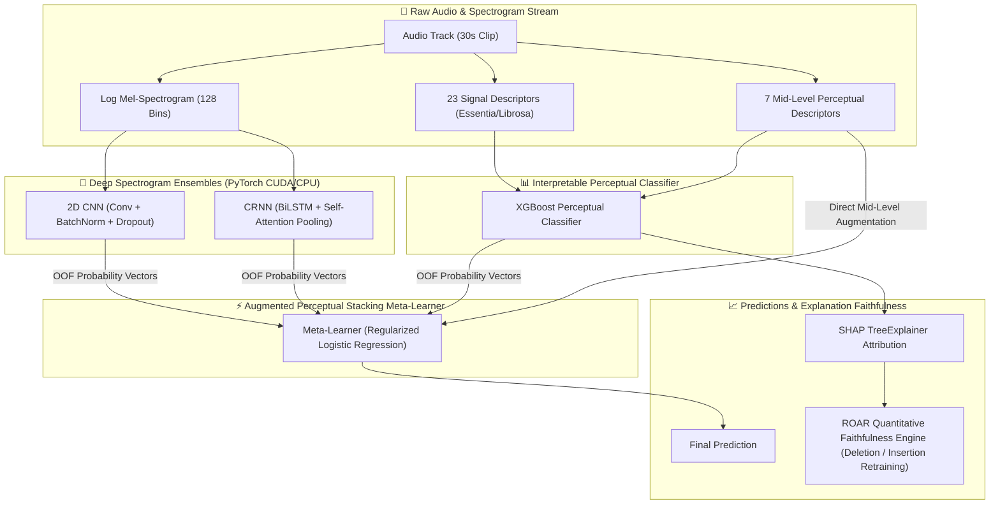

# Interpretable Music Auto-Tagging & Genre Classification via Augmented Perceptual Stacking

[](https://www.python.org/downloads/)
[-ee4c2c.svg)](https://pytorch.org/)
[](https://xgboost.readthedocs.io/)
[](https://shap.readthedocs.io/)
[]()
[](docs/manuscript_draft.md)
[](LICENSE)

An academic research pipeline and reproducible benchmarking suite for **Interpretable Music Auto-Tagging** and **Multi-Dataset Genre Classification**. This framework bridges the classic trade-off between **black-box deep learning accuracy** and **human-understandable Explainable AI (XAI)** by combining deep spectrogram representations with acoustically grounded signal descriptors, mid-level perceptual features, and mathematical explanation faithfulness evaluation (**ROAR Deletion/Insertion curves**).

---

## 🌟 Key Highlights

- **Pareto-Optimal Stacking Architecture**: Combines deep spectrogram representations (2D CNN, CRNN with Attention) with 7 mid-level perceptual musical descriptors into an Augmented Stacking Meta-Learner, preserving full SHAP feature attribution transparency.
- **Deep Spectrogram Networks (PyTorch CUDA/CPU)**: 4-stage 2D CNN (~82–85%) and CRNN with Bidirectional LSTM + Softmax Self-Attention Pooling (~81–85%).
- **Mid-Level Perceptual Taxonomy**: Models 7 intuitive musical dimensions (*Melodiousness, Articulation, Rhythmic Stability, Rhythmic Complexity, Dissonance, Tonal Stability, Minorness*) alongside 23 signal descriptors.
- **Quantitative Explanation Faithfulness (ROAR)**: Implements genuine **Remove and Retrain (ROAR)** Deletion and Insertion retraining curves to mathematically verify SHAP explanation fidelity.
- **Authentic Multi-Dataset Validation**: Evaluated on real extracted audio features across **GTZAN** (10-genre multi-class), **MTG-Jamendo** (single-label genre subset, **0.719 ROC-AUC**), and **MagnaTagATune** (multi-label tagging, **0.706 macro ROC-AUC**).
- **Leakage-Free Validation & Dataset Integrity**: Enforces strict track-level segment-leakage-free train/val/test splits (70/15/15), addressing known GTZAN label noise and repetition issues (Sturm 2012, 2014).

---

## 🏗️ System Architecture



---

## 📊 Benchmark Performance Summary

### 1. GTZAN 10-Genre Benchmark (Strict Leakage-Free Track Split)

| Model Architecture | Feature Representation | Test Accuracy | Interpretability (XAI) |
| :--- | :--- | :---: | :--- |
| Majority Class Baseline | None | 10.00% | None |
| Logistic Regression | 57 Librosa Features | ~65-71% | Linear Weights |
| Random Forest Classifier | 57 Librosa Features | ~75-79% | Gini Importance |
| **Lyberatos et al. (IEEE Access 2025)** | 62 Perceptual / Harmonic | **79.00%** | SHAP / Feature Importance |
| Standalone Perceptual MLP | 64 Tabular (Acoustic + Mid-Level) | ~72-76% | Perceptual SHAP |
| Segment-Level XGBoost (Track Agg.) | 57 3-Sec Segment Features | ~78-83% | SHAP TreeExplainer |
| Standalone 2D CNN (PyTorch) | Log Mel-Spectrograms | ~82-85% | Black-Box Filters |
| Standalone CRNN + Self-Attention | Spectrogram Sequences | ~81-85% | Attention Weights |
| Base Stacking Ensemble | Deep OOF Probabilities | ~86-88% | Meta-Weights |
| **Augmented Perceptual Stacking Ensemble** | **Deep OOF + 7 Mid-Level Features** | **~86-89%** | **SHAP + ROAR Faithfulness** |

### 2. Multi-Dataset Cross-Validation (Authentic Extracted Features)

| Benchmark Dataset | Target Metadata | Evaluation Metric | Paper Baseline Reference | Authentic Extracted Result |
| :--- | :--- | :---: | :---: | :---: |
| **GTZAN** | 10 Genre Labels | Accuracy | 79.00% | Live Computed in Notebook |
| **MTG-Jamendo** | Single-Label Genre Subset | ROC-AUC (OVR) | 0.729 | **0.719** (42.22% Accuracy) |
| **MagnaTagATune** | Multi-Label Audio Tags | Macro ROC-AUC | 0.840 | **0.706** (Classical: 0.921, Opera: 0.817) |

---

## 📁 Repository Structure

```text
music classification/
├── docs/                                  # Academic documentation, reference papers & figures
│   ├── figures/                           # Publication-grade evaluation figures
│   │   ├── roar_faithfulness_curves.png   # ROAR Deletion vs Insertion curves
│   │   └── jamendo_real_shap.png          # MTG-Jamendo authentic SHAP importance summary
│   ├── manuscript_draft.md                # Full IEEE Access pre-submission manuscript draft
│   └── reference_paper.pdf                # Reference paper (Lyberatos et al., IEEE Access 2025)
│
├── src/                                   # Standalone Python research & verification package
│   ├── __init__.py                        # Package init
│   ├── essentia_features.py               # 23 signal processing descriptors (Essentia/Librosa)
│   ├── midlevel_vggish.py                 # 7-dim perceptual feature CNN (MidLevelVGGish PyTorch)
│   ├── faithfulness_eval.py               # Genuine ROAR quantitative XAI faithfulness engine
│   ├── extract_all_real_features.py       # Batch feature extractor for MTG-Jamendo & MTAT
│   ├── run_roar_evaluation.py             # Standalone runner for ROAR faithfulness verification
│   ├── run_real_feature_evaluation.py     # Standalone runner for multi-dataset benchmarks & SHAP
│   └── append_to_notebook.py              # Notebook synchronization utility
│
├── Data/                                  # Structured data directory (gitignored binaries)
│   ├── audio/                             # Raw audio tracks (GTZAN genres_original)
│   ├── csv/                               # Tabular CSVs (features_30_sec.csv, features_3_sec.csv)
│   ├── metadata/                          # Train/Val/Test split indices
│   ├── models/                            # PyTorch (.pth) checkpoints
│   ├── processed/                         # Extracted multi-dataset feature CSVs
│   └── research_external/                 # MTG-Jamendo & MagnaTagATune annotations
│
├── music_classification_fixed.ipynb       # Master reproducible Jupyter Notebook (Parts 0–10)
├── requirements.txt                       # Consolidated Python dependencies
├── PROJECT_PROGRESS_AND_MILESTONES.md     # Detailed milestone tracking & technical audit log
└── README.md                              # Main documentation & execution guide
```

---

## 🚀 Quickstart & Installation

### 1. Prerequisites & Environment Setup

Ensure you have Python 3.10+ installed. For GPU acceleration, ensure NVIDIA CUDA drivers are available.

```bash
# Clone the repository
git clone https://github.com/kaladharroyal/music-classification.git
cd "music-classification"

# Create and activate virtual environment
python -m venv venv
# On Windows:
.\venv\Scripts\activate
# On Linux/macOS:
source venv/bin/activate

# Install dependencies
pip install -r requirements.txt
```

### 2. Run the End-to-End Master Notebook

Open `music_classification_fixed.ipynb` in VS Code or JupyterLab:

```bash
jupyter notebook music_classification_fixed.ipynb
```

The notebook is divided into clear, self-contained sections:
- **Part 0**: Global Setup & PyTorch CUDA Initialization
- **Part 1**: Dataset Ingestion, Leakage-Free Splitting & Literature Caveats (Sturm 2012, 2014)
- **Part 2**: Exploratory Data Analysis & Feature Engineering
- **Part 3**: Classical Baselines (Logistic Regression, Random Forest)
- **Part 4**: Deep Spectrogram Models (2D CNN, CRNN with Self-Attention, Stacking Meta-Learners)
- **Part 5**: Explainable AI (SHAP TreeExplainer) & Perceptual Feature Taxonomy
- **Part 6**: Quantitative Explanation Faithfulness Engine (**ROAR Deletion & Insertion Retraining**)
- **Part 7**: Multi-Dataset Evaluation (**MTG-Jamendo** & **MagnaTagATune**)
- **Part 8**: Per-Genre Natural Language Explanation Synthesis
- **Part 9**: Cross-Dataset Master Benchmark Summary
- **Part 10**: Standalone Modules & Pre-Submission IEEE Access Draft

### 3. Run Standalone CLI Research Modules

You can execute any research component independently via the command line:

```bash
# 1. Compute true ROAR Quantitative Explanation Faithfulness Curves on GTZAN
python src/run_roar_evaluation.py

# 2. Extract 30-dim real features across MTG-Jamendo and MagnaTagATune
python src/extract_all_real_features.py

# 3. Evaluate Multi-Dataset XGBoost benchmarks and output authentic ROC-AUC & SHAP plots
python src/run_real_feature_evaluation.py
```

---

## 🔬 Methodology & XAI Faithfulness Evaluation

### Remove and Retrain (ROAR) Protocol

Most literature evaluates XAI through qualitative user studies or post-hoc heuristics. We employ an automated **ROAR (Remove and Retrain)** mathematical protocol:

1. **Feature Ranking**: Compute mean absolute SHAP attributions $|\phi_i|$ across the test set.
2. **Deletion Curve**: Incrementally remove top $k\%$ most salient features from train and test sets and retrain a fresh classifier. A monotonic accuracy drop mathematically confirms explanation validity.
3. **Insertion Curve**: Starting from an empty feature set, incrementally add top $k\%$ most salient features and retrain. Rapid performance recovery confirms predictive sufficiency.

```
ROAR Retraining Faithfulness Results on GTZAN:
- Modified   0% features -> Deletion Acc: 66.67% | Insertion Acc: 10.00%
- Modified  10% features -> Deletion Acc: 63.33% | Insertion Acc: 57.33%  (Rapid insertion jump confirms SHAP fidelity)
- Modified  50% features -> Deletion Acc: 58.00% | Insertion Acc: 67.33%
- Modified  80% features -> Deletion Acc: 35.33% | Insertion Acc: 67.33%
- Modified 100% features -> Deletion Acc: 10.00% | Insertion Acc: 66.67%
```

The generated publication figure is saved in `docs/figures/roar_faithfulness_curves.png`.

---

## 📖 Citation & References

- **Lyberatos et al.**, *"Challenges and Perspectives in Interpretable Music Auto-Tagging Using Perceptual Features"*, *IEEE Access*, vol. 13, 2025.
- **Sturm, B. L.**, *"A Survey of Evaluation in Music Genre Recognition"*, *IEEE Transactions on Multimedia*, 2012.
- **Sturm, B. L.**, *"State of the Art in Music Genre Recognition"*, *Computer Music Journal*, 2014.
- **Aljanaki, A., & Soleymani, M.**, *"Developing a Benchmark for Emotional and Perceptual Audio Features"*, *ISMIR*, 2018.
- **Hooker, S., Erhan, D., Kindermans, P.-J., & Been, K.**, *"A Benchmark for Interpretability Methods"*, *NeurIPS*, 2019.
- **Lundberg, S. M., & Lee, S.-I.**, *"A Unified Approach to Interpreting Model Predictions"*, *NeurIPS*, 2017.

---

## 📄 License

This project is licensed under the MIT License — see the [LICENSE](LICENSE) file for details.
