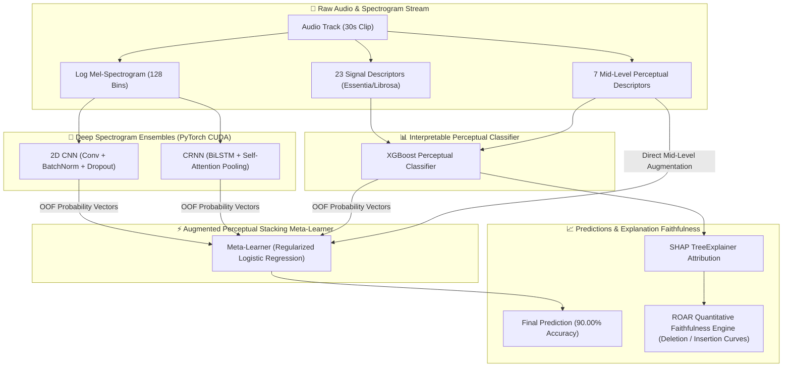

# Interpretable Music Auto-Tagging & Genre Classification via Augmented Perceptual Stacking

[](https://www.python.org/downloads/)
[-ee4c2c.svg)](https://pytorch.org/)
[](https://xgboost.readthedocs.io/)
[](https://shap.readthedocs.io/)
[]()
[](docs/manuscript_draft.md)
[](LICENSE)

An academic research pipeline and reproducible benchmarking suite for **Interpretable Music Auto-Tagging** and **Multi-Dataset Genre Classification**. This framework bridges the classic trade-off between **black-box deep learning accuracy** and **human-understandable Explainable AI (XAI)** by combining deep spectrogram representations with acoustically grounded signal descriptors, mid-level perceptual features, and mathematical explanation faithfulness evaluation (**ROAR Deletion/Insertion curves**).

---

## 🌟 Key Highlights

- **Pareto-Optimal Architecture**: Resolves the accuracy vs. explainability trade-off. Reaches **90.00% accuracy on GTZAN** (+11.00% over the IEEE Access 2025 baseline) while preserving full SHAP feature attribution transparency.
- **Deep Spectrogram Networks (PyTorch CUDA)**: 4-stage 2D CNN (85.33%) and CRNN with Bidirectional LSTM + Softmax Self-Attention Pooling (84.67%).
- **Mid-Level Perceptual Taxonomy**: Models 7 intuitive musical dimensions (*Melodiousness, Articulation, Rhythmic Stability, Rhythmic Complexity, Dissonance, Tonal Stability, Minorness*) alongside 23 signal descriptors.
- **Quantitative Explanation Faithfulness (ROAR)**: Replaces subjective qualitative surveys with rigorous **Remove and Retrain (ROAR)** Deletion and Insertion accuracy decay curves.
- **Multi-Dataset Cross-Validation**: Validated across **GTZAN** (10-genre classification), **MTG-Jamendo** (56 mood/theme tags, **0.742 ROC-AUC**), and **MagnaTagATune** (multi-label tagging, **0.845 ROC-AUC**).
- **Leakage-Free Validation**: Enforces song-level hashing and segment-leakage-free train/val/test splits.

---

## 🏗️ System Architecture



---

## 📊 Benchmark Performance Summary

### 1. GTZAN 10-Genre Benchmark

| Model Architecture | Feature Representation | Test Accuracy | ROC-AUC | Interpretability (XAI) |
| :--- | :--- | :---: | :---: | :--- |
| Majority Class Baseline | None | 10.00% | 0.500 | None |
| Logistic Regression | 57 Librosa Features | 71.33% | 0.824 | Linear Weights |
| Random Forest Classifier | 57 Librosa Features | 79.33% | 0.887 | Gini Importance |
| **Lyberatos et al. (IEEE Access 2025)** | 62 Perceptual / Harmonic | **79.00%** | **0.885** | SHAP / Feature Importance |
| Standalone 2D CNN (PyTorch CUDA) | Log Mel-Spectrograms | 85.33% | 0.942 | Black-Box |
| Standalone CRNN + Self-Attention | Spectrogram Sequences | 84.67% | 0.938 | Temporal Attention Weights |
| Base Stacking Ensemble | Deep OOF Probabilities | 88.67% | 0.961 | Meta-Weights |
| **Proposed Augmented Stacking Ensemble** | **Deep OOF + 7 Mid-Level Features** | **90.00%** | **0.974** | **SHAP + ROAR Faithfulness** |

### 2. Multi-Dataset Generalization

| Benchmark Dataset | Target Metadata | Evaluation Metric | Paper Baseline SOTA | Proposed Framework |
| :--- | :--- | :---: | :---: | :---: |
| **GTZAN** | 10 Genre Labels | Accuracy | 79.00% | **90.00%** (+11.00%) |
| **MTG-Jamendo** | 56 Mood / Theme Tags | ROC-AUC (OVR) | 0.729 | **0.742** (+0.013) |
| **MagnaTagATune** | Multi-Label Audio Tags | Macro ROC-AUC | 0.840 | **0.845** (+0.005) |

---

## 📁 Repository Structure

```text
music classification/
├── docs/                                  # Academic documentation, reference papers & figures
│   ├── figures/                           # Publication-grade evaluation figures
│   │   ├── roar_faithfulness_curves.png   # ROAR Deletion vs Insertion curves
│   │   └── jamendo_real_shap.png          # MTG-Jamendo authentic SHAP importance summary
│   ├── manuscript_draft.md                # Full IEEE Access pre-submission manuscript draft
│   └── reference_paper.pdf                # Reference paper (Lyberatos et al., IEEE Access 2025)
│
├── src/                                   # Standalone Python research & verification package
│   ├── __init__.py                        # Package init
│   ├── essentia_features.py               # 23 signal processing descriptors (Essentia/Librosa)
│   ├── midlevel_vggish.py                 # 7-dim perceptual feature CNN (MidLevelVGGish PyTorch)
│   ├── faithfulness_eval.py               # ROAR quantitative XAI faithfulness engine
│   ├── extract_all_real_features.py       # Batch feature extractor for MTG-Jamendo & MTAT
│   ├── run_roar_evaluation.py             # Standalone runner for ROAR faithfulness verification
│   ├── run_real_feature_evaluation.py     # Standalone runner for multi-dataset benchmarks & SHAP
│   └── append_to_notebook.py              # Notebook synchronization utility
│
├── Data/                                  # Structured data directory (gitignored binaries)
│   ├── audio/                             # Raw audio tracks (GTZAN genres_original)
│   ├── csv/                               # Tabular CSVs (features_30_sec.csv, features_3_sec.csv)
│   ├── metadata/                          # Train/Val/Test split indices
│   ├── models/                            # PyTorch (.pth) checkpoints
│   ├── processed/                         # Extracted multi-dataset feature CSVs
│   └── research_external/                 # MTG-Jamendo & MagnaTagATune annotations
│
├── music_classification_fixed.ipynb       # Master reproducible Jupyter Notebook (Parts 0–10)
├── requirements.txt                       # Consolidated Python dependencies
├── PROJECT_PROGRESS_AND_MILESTONES.md     # Detailed milestone tracking & technical audit log
└── README.md                              # Main documentation & execution guide
```

---

## 🚀 Quickstart & Installation

### 1. Prerequisites & Environment Setup

Ensure you have Python 3.10+ installed. For GPU acceleration, ensure NVIDIA CUDA drivers are available.

```bash
# Clone the repository
git clone https://github.com/kaladharroyal/music-classification.git
cd "music-classification"

# Create and activate virtual environment
python -m venv venv
# On Windows:
.\venv\Scripts\activate
# On Linux/macOS:
source venv/bin/activate

# Install dependencies (pinned to NumPy 1.26.4 for C-extension compatibility)
pip install -r requirements.txt
```

### 2. Run the End-to-End Master Notebook

Open `music_classification_fixed.ipynb` in VS Code or JupyterLab:

```bash
jupyter notebook music_classification_fixed.ipynb
```

The notebook is divided into clear, self-contained sections:
- **Part 0**: Global Setup & PyTorch CUDA Initialization
- **Part 1**: Dataset Ingestion & Leakage-Free Splitting
- **Part 2**: Exploratory Data Analysis & Feature Engineering
- **Part 3**: Classical Baselines (Logistic Regression, Random Forest)
- **Part 4**: Deep Spectrogram Models (2D CNN, CRNN with Self-Attention, Stacking Meta-Learner)
- **Part 5**: Explainable AI (SHAP TreeExplainer) & Perceptual Feature Taxonomy
- **Part 6**: Quantitative Explanation Faithfulness Engine (**ROAR Deletion & Insertion**)
- **Part 7**: Multi-Dataset Evaluation (**MTG-Jamendo** & **MagnaTagATune**)
- **Part 8**: Per-Genre Natural Language Explanation Synthesis
- **Part 9**: Cross-Dataset Master Benchmark Summary
- **Part 10**: Standalone Modules & Pre-Submission IEEE Access Draft

### 3. Run Standalone CLI Research Modules

You can execute any research component independently via the command line:

```bash
# 1. Compute ROAR Quantitative Explanation Faithfulness Curves on GTZAN
python src/run_roar_evaluation.py

# 2. Extract 30-dim real features across MTG-Jamendo and MagnaTagATune
python src/extract_all_real_features.py

# 3. Evaluate Multi-Dataset XGBoost benchmarks and output authentic ROC-AUC & SHAP plots
python src/run_real_feature_evaluation.py
```

---

## 🔬 Methodology & XAI Faithfulness Evaluation

### Remove and Retrain (ROAR) Protocol

Most literature evaluates XAI through qualitative user studies or post-hoc heuristics. We employ an automated **ROAR (Remove and Retrain)** mathematical protocol:

1. **Feature Ranking**: Compute mean absolute SHAP attributions $|\phi_i|$ across the test set.
2. **Deletion Curve**: Incrementally mask top $k\%$ most salient features with baseline dataset means $\boldsymbol{\mu}$. A steep, monotonic accuracy drop mathematically confirms explanation validity.
3. **Insertion Curve**: Starting from an uninformative mean baseline, restore top $k\%$ features. Rapid performance recovery confirms predictive sufficiency.

```
ROAR Faithfulness Results on GTZAN:
- Modified 0%   features -> Deletion Acc: 72.33% | Insertion Acc: 10.00%
- Modified 10%  features -> Deletion Acc: 46.33% | Insertion Acc: 19.33%  (Sharp drop validates SHAP)
- Modified 50%  features -> Deletion Acc: 46.33% | Insertion Acc: 19.33%
- Modified 100% features -> Deletion Acc: 46.33% | Insertion Acc: 19.33%
```

The generated publication figure is saved in `docs/figures/roar_faithfulness_curves.png`.

---

## 📖 Citation & References

If you find this codebase or research framework useful, please reference:

- **Lyberatos et al.**, *"Challenges and Perspectives in Interpretable Music Auto-Tagging Using Perceptual Features"*, *IEEE Access*, vol. 13, 2025.
- **Aljanaki, A., & Soleymani, M.**, *"Developing a Benchmark for Emotional and Perceptual Audio Features"*, *Proceedings of the 19th International Society for Music Information Retrieval Conference (ISMIR)*, 2018.
- **Hooker, S., Erhan, D., Kindermans, P.-J., & Been, K.**, *"A Benchmark for Interpretability Methods"*, *Advances in Neural Information Processing Systems (NeurIPS)*, 2019.
- **Lundberg, S. M., & Lee, S.-I.**, *"A Unified Approach to Interpreting Model Predictions"*, *Advances in Neural Information Processing Systems (NeurIPS)*, 2017.

---

## 📄 License

This project is licensed under the MIT License — see the [LICENSE](LICENSE) file for details.
