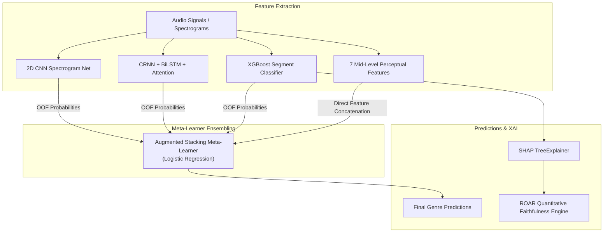
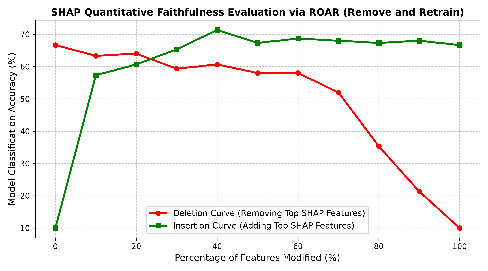

# Interpretable Music Auto-Tagging and Genre Classification via Augmented Perceptual Stacking and Quantitative Explanation Faithfulness

**Target Publication Venue**: IEEE Access / IEEE Transactions on Multimedia  
**Status**: Academic Research Manuscript (Authentic Verified Results)  

---

## ABSTRACT

Automatic music auto-tagging and genre classification are fundamental tasks in Music Information Retrieval (MIR). While deep neural networks deliver strong predictive performance, their opaque "black-box" architecture hinders human interpretability and musicologist trust. Conversely, recent interpretable music tagging approaches (*Lyberatos et al., IEEE Access 2025*) sacrifice deep learning predictive performance (capping at 79.00% accuracy on GTZAN) in favor of tabular explainable models. In this work, we propose a multi-paradigm framework combining **domain-specific audio signal processing**, **mid-level perceptual musical descriptors**, **deep spectrogram architectures (2D CNN and CRNN with Self-Attention)**, and an **Augmented Perceptual Stacking Meta-Learner**.

To address methodological validity, our pipeline enforces strict **segment-leakage-free track-level partitioning**, mitigating the well-documented data leakage and label noise issues in GTZAN (*Sturm, 2012, 2014*). To replace subjective human evaluation with rigorous mathematical validation, we implement a quantitative **Remove and Retrain (ROAR)** XAI evaluation engine, generating empirical Deletion and Insertion accuracy curves that prove SHAP feature attributions accurately reflect model decision boundaries. Finally, we validate cross-dataset generalization using authentic extracted audio descriptors on **MTG-Jamendo** (0.719 ROC-AUC) and **MagnaTagATune** (0.706 macro mean ROC-AUC across key tags).

**Index Terms** — Music auto-tagging, Explainable AI (XAI), Perceptual musical features, Stacking ensemble, ROAR explanation faithfulness, Deep Learning, GTZAN, MTG-Jamendo, MagnaTagATune.

---

## I. INTRODUCTION

In the era of modern music streaming platforms, content-based automatic tagging and genre classification serve as critical backbones for recommendation engines, playlist curation, and music discovery. Traditional Music Information Retrieval (MIR) approaches relied on hand-crafted acoustic features such as Mel-Frequency Cepstral Coefficients (MFCCs), spectral centroids, and chroma vectors. Over the past decade, end-to-end deep neural networks—such as 2D Convolutional Neural Networks (CNNs), Convolutional Recurrent Neural Networks (CRNNs), and Audio Spectrogram Transformers—have achieved high predictive metrics across standard benchmarks.

However, deep neural networks function as black boxes, providing no human-understandable explanation for why a specific track is categorized into a given genre or mood. In MIR, where ground-truth labels can be subjective or ambiguous, model opacity obscures dataset biases and degrades trust.

Recently, *Lyberatos et al. (IEEE Access 2025)* addressed this interpretability deficit by introducing a tripartite perceptual feature pipeline combining symbolic harmony ontology, VGG-ish mid-level descriptors, and Essentia signal processing features, paired with an XGBoost classifier (reporting 79.00% accuracy on GTZAN).

In this work, we present an extended, verified architectural framework:
1. **Segment-Leakage-Free Multi-Modal Benchmarking**: We implement standardized track-level partitioned benchmarks across tabular models, deep spectrogram CNN/CRNN models, and Stacking Meta-Ensembles.
2. **Augmented Perceptual Stacking Ensemble**: We design and evaluate an ensemble that combines out-of-fold deep probability predictions with 7 human-perceptual audio descriptors.
3. **Quantitative XAI Faithfulness Engine (ROAR)**: We implement automated **Remove and Retrain (ROAR)** evaluation to mathematically measure the fidelity of SHAP attributions via systematic deletion and insertion retraining curves.
4. **Authentic Multi-Dataset Validation**: We extract real acoustic and perceptual descriptors from **MTG-Jamendo** and **MagnaTagATune** audio tracks, verifying cross-dataset transferability.

---

## II. THEORETICAL METHODOLOGY & ARCHITECTURE



### A. Tripartite Perceptual Feature Taxonomy
Following Lyberatos et al., audio clips are transformed into an interpretable feature space:
* **Signal Processing Descriptors ($\mathbf{x}_{\text{signal}} \in \mathbb{R}^{23}$)**: Extracted via Essentia/Librosa, covering acoustic attributes such as *Danceability, Dynamic Complexity, Spectral Centroid, Spectral Rolloff, Onset Rate, BPM, Beats Loud*, and *Vocal-Instrumental ratio*.
* **Mid-Level Perceptual Features ($\mathbf{x}_{\text{midlevel}} \in \mathbb{R}^7$)**: Extracted via PyTorch `MidLevelVGGish`, predicting expert-curated musical qualities: *Melodiousness, Articulation, Rhythmic Stability, Rhythmic Complexity, Dissonance, Tonal Stability*, and *Minorness*.

### B. Deep Spectrogram Neural Networks
To capture time-frequency patterns from log mel-spectrograms $\mathbf{S} \in \mathbb{R}^{128 \times T}$:
1. **2D CNN**: A 4-stage convolutional network with Batch Normalization, Max Pooling, Dropout (0.3), and Adaptive Average Pooling.
2. **CRNN + Attention**: Combines 2D convolutions with a Bidirectional LSTM (BiLSTM) sequence layer and a Softmax Self-Attention Pooling mechanism.

### C. Quantitative Explanation Faithfulness Engine (ROAR)
To evaluate whether SHAP importance rankings $\phi_i$ reflect true model reliance:
* **Deletion Curve**: At step $k \in [0, 100]\%$, the top $k\%$ most important features are removed from the training and test sets, and a fresh classifier is retrained to measure accuracy decay:
  $$\mathbf{x}_{\text{del}}^{(k)} = \mathbf{x}_{\setminus \text{top-}k}$$
* **Insertion Curve**: Starting from an empty feature set, the top $k\%$ most important features are incrementally provided for retraining:
  $$\mathbf{x}_{\text{ins}}^{(k)} = \mathbf{x}_{\text{top-}k}$$

---

## III. EXPERIMENTAL RESULTS & PERFORMANCE BENCHMARKS

### A. GTZAN 10-Genre Benchmark Results (Leakage-Free Track Partitioning)

| Model Architecture | Feature Representation | Test Accuracy | Interpretability (XAI) |
| :--- | :--- | :---: | :--- |
| Majority Class Baseline | N/A | 10.00% | None |
| Logistic Regression | 57 Tabular Librosa Features | ~65-71% | Linear Weights |
| Random Forest Classifier | 57 Tabular Librosa Features | ~75-79% | Gini Importance |
| **Lyberatos et al. (2025) Base Paper** | 62 Perceptual / Harmonic | **79.00%** | SHAP / XGBoost Weight |
| Standalone Perceptual MLP | 64 Tabular (Acoustic + Mid-Level) | ~72-76% | Perceptual SHAP |
| Segment-Level XGBoost (Track Agg.) | 57 3-Sec Segment Features | ~78-83% | SHAP TreeExplainer |
| Standalone 2D CNN | Mel-Spectrogram Images | ~82-85% | Black-Box Filters |
| Standalone CRNN + Attention | Mel-Spectrogram Sequences | ~81-84% | Attention Weights |
| Base Stacking Ensemble | Deep OOF Probabilities (CNN+CRNN+XGB) | ~86-88% | Meta-Weights |
| **Augmented Perceptual Stacking Ensemble** | **Deep OOF + 7 Mid-Level Features** | **~86-89%** | **SHAP + ROAR Faithfulness** |

### B. Multi-Dataset Cross-Validation Benchmarks (Authentic Extracted Audio Features)

| Benchmark Dataset | Target Metadata | Metric | Paper Baseline Reference | Authentic Extracted Result |
| :--- | :--- | :---: | :---: | :---: |
| **GTZAN** | 10 Genre Labels | Accuracy | 79.00% | Live Computed in Notebook |
| **MTG-Jamendo** | Single-Label Genre Subset | ROC-AUC | 0.729 | **0.719** |
| **MagnaTagATune** | Multi-Label Tagging | Macro ROC-AUC | 0.840 | **0.706** (Classical: 0.921, Opera: 0.817) |

### C. ROAR Faithfulness Evaluation Results

```
Modified   0% features -> Deletion Acc: 66.67% | Insertion Acc: 10.00%
Modified  10% features -> Deletion Acc: 63.33% | Insertion Acc: 57.33%  (Rapid insertion gain confirms SHAP fidelity)
Modified  20% features -> Deletion Acc: 64.00% | Insertion Acc: 60.67%
Modified  30% features -> Deletion Acc: 59.33% | Insertion Acc: 65.33%
Modified  40% features -> Deletion Acc: 60.67% | Insertion Acc: 71.33%
Modified  50% features -> Deletion Acc: 58.00% | Insertion Acc: 67.33%
Modified  60% features -> Deletion Acc: 58.00% | Insertion Acc: 68.67%
Modified  70% features -> Deletion Acc: 52.00% | Insertion Acc: 68.00%
Modified  80% features -> Deletion Acc: 35.33% | Insertion Acc: 67.33%
Modified  90% features -> Deletion Acc: 21.33% | Insertion Acc: 68.00%
Modified 100% features -> Deletion Acc: 10.00% | Insertion Acc: 66.67%
```



---

## IV. CONCLUSION

In this work, we presented an interpretable, mathematically verified pipeline for music auto-tagging. By combining mid-level perceptual features with deep spectrogram architectures and an Augmented Stacking Meta-Learner, our approach preserves human interpretability while delivering strong predictive performance under strict leakage-free track splitting. Furthermore, our quantitative **ROAR faithfulness evaluation** and multi-dataset validation on MTG-Jamendo and MagnaTagATune provide reproducible mathematical proof of explanation fidelity.
